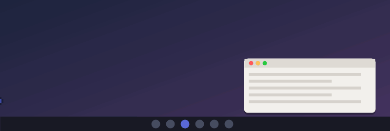

# Flippy

A little pixel buddy who lives on your Windows desktop.

<p align="center"></p>

Flippy comes with a little gang of pets: Flip the flip phone (the default), Hopper the frog, Flapjack the pancake and Clawd (classic). Your pet walks along your taskbar and climbs onto your windows. When you type, he types along on his tiny laptop. When you watch a video, he grabs popcorn and watches with you. He gets hungry, tired and bored, so feed him, pet him and play with him.

## Install

1. **[Download Flippy](https://github.com/finnvangronsveld/flippy/releases/latest/download/Flippy.zip)** and unzip it anywhere.
2. Double-click **`Install Flippy.cmd`**.

You don't need admin rights or anything else installed: Flippy is a single small `Flippy.exe`. He appears at the bottom of your screen and starts with Windows; you can turn that off in his settings.

- **Bring him back:** if you send him away, start **Flippy** from the Start menu.
- **Uninstall:** use **Settings › Apps**, or double-click `Uninstall Flippy.cmd`.
- **No install:** you can also just double-click `Flippy.exe`. He adds himself to the Start menu.

> Flippy isn't code-signed, so Windows SmartScreen may say "Windows protected your PC". Click **More info → Run anyway**. The full source is in this repo.

## Pick your pet

Right-click your pet and choose **Change pet**. His hologram switches to a list with a live preview of every pet. Click one, and your current pet does a front flip, there's a poof, and the new one lands in the same spot. You can also choose in **Settings**.

- **Flip** (the default): a flip phone with feelings. His face lives on the LCD screen.
- **Hopper**: a frog who flips.
- **Flapjack**: a pancake stack with butter and syrup.
- **Clawd (classic)**: the original orange buddy. His thing is smashing his laptop.

Flip, Hopper and Flapjack all do a front flip as their signature move: Flippy is named after Flipforward.

Every pet can do everything below. Your choice, settings and his hunger levels are remembered.

## His menu: a hologram

Right-click him and he projects a hologram above his head: his name and mood bars, **Play**, **Tricks** and **Heroes** buttons, then **Pocket**, **Change pet**, **Settings...** and **Bye**. It closes when you pick something, click anywhere else (him included), press Esc, switch windows, or move away.

## Claude Code buddy

He tells you when Claude Code needs you:

- **Claude is done:** he hops, waves and says "Claude is done!", with the project name.
- **Claude has a question** or needs your OK for something: he jumps up and down with a red "!" and shows the question until you click him or start typing.

To turn it on, open **Settings...** and click **Connect to Claude Code**. This adds a few hooks to your Claude Code settings (`~/.claude/settings.json`; a backup is kept), so restart any open Claude Code sessions afterwards. It works in the terminal and in the Claude desktop app's Code tab. Click **Disconnect** to remove it again.

## His pocket

Drop up to **3 files or folders** on him and he keeps them in his pocket (a 4th pushes the oldest out). Get them back from **Pocket** in his menu:

- **click** a file to copy it, then paste it anywhere (Ctrl+V in Explorer, a chat, an email...)
- **drag** a file out of the hologram onto a folder, the desktop or an app
- **x** removes it, **Empty the pocket** removes all

He only remembers where the files are; nothing is moved or copied until you take it out.

**Peek:** when there's something in his pocket, hold the cursor still on him for a moment and the pocket pops up by itself. Move away and it closes.

## Superheroes

Now and then (or from **Heroes** in his menu) he spins into a suit:

- **Web-slinger:** swings across the screen on a real pendulum, webbing onto window edges, the top of the screen or your cursor. The web line wobbles and sags like a real rope.
- **Caped flyer:** crouches, launches and flies across the screen in a big arc, cape streaming, then a super landing.
- **Speedster:** zooms back and forth along the taskbar with a lightning trail, then skids to a stop.
- **Night guardian:** grapples up high, perches, then glides down with his cape spread.
- **Shield hero:** throws his shield at your cursor; it bounces off the screen edges and comes back to his hand.

## Anime battle

His shadow shows up. They power up (auras, sparks, the ground shakes), dash in and clash, charge up and fire beams that meet in the middle. After a beam struggle his beam wins, the shadow blows up, and he says "too easy." Pick **Anime battle!** in his menu, or wait for it.

## Sandcastles

Sometimes he walks to a corner of your screen and builds a sandcastle: a pile, a base, towers, a keep with a door, battlements, a flag and a shell. It stays for a few minutes, then crumbles.

## Flipforward

Flippy was made by [Flipforward](https://flipforward.be). Open **flipforward.be** in your browser and he gets heart eyes ("that's my creator!"); open his home, **[flippy.flipforward.be](https://flippy.flipforward.be)**, and he cheers. He stays extra happy while the site is in front.

## Playing with him

| Do this | He does |
|---|---|
| Left-click | Hops |
| Click 4× quickly | Gets dizzy |
| Drag him | Dangles and flails ("wheee!") |
| **Throw him** | Flies, spins, bounces off the screen edges, and lands dizzy after a big throw. You can land him on a window. |
| Rub the cursor over him | Blushes and floats hearts |
| Bring the cursor near | Waves hi |
| Right-click | Projects his hologram menu (see above) |
| **Do your thing!** (menu) | His signature move |
| **Give him a snack** (menu) | A cookie, pizza, apple or donut drops in. Drag it to him, or he walks over and eats it in three bites. |
| **Drop a file on him** | Has an opinion ("a pdf... very official", "I'm NOT running that") and tucks it in his pocket |
| Type | He pulls out his laptop and types along, one hand per key |
| Pause typing | He thinks: spinner plus "Clauding...", "Percolating..." and so on |
| Watch a video (YouTube, Netflix, Twitch, VLC, ...) | He picks a seat under it, sits with his back to you in the glow of the screen, eats popcorn and comments |
| Pause the video | He turns around and stomps ("hey! I was watching!"), then sulks until you press play |
| Play music (Spotify etc.) | Headphones on, bopping along |
| Stay away for a minute | He yawns and naps |

### Moods

He has four needs: **food, energy, fun and love**. You can see them in his menu.

- They slowly drain and are remembered between sessions.
- **Hungry:** he complains and walks slower. Give him a snack.
- **Tired:** he naps, and wears a nightcap late at night.
- **Bored:** he comes looking for attention.
- **Loved:** heart eyes when he looks at you.

### He notices your PC

- **Low battery:** "plug me in?". Plugging in: "ahh, power!".
- **Busy CPU:** he fans himself and sweats.
- **Copying something:** a little paper floats down and he catches it.
- **Late at night:** "go to sleep, human".
- **Coming back after a long break:** "good morning!".

### On his own, he also

- chases your cursor
- dances
- takes coffee breaks
- thinks hard
- does his signature move
- spots any window he can reach, runs over, jumps onto it and rides along when you move it
- shoots tiny pellets at your cursor, aiming in every direction
- pulls off trickshots: 360 no-scopes, no-look shots and ricochets
- suits up as a superhero (see above)
- has an anime battle with his shadow
- builds a sandcastle in a corner
- smashes his laptop ("fixed it.")

He never steals focus from what you're doing, and he doesn't show up in the taskbar or Alt+Tab.

### Settings

Right-click him and choose **Settings...**. From there you can:

- pick your pet
- turn individual things on or off: the gun, trickshots, the superhero suits, anime battles, sandcastles, laptop smashing, movie night, the pause tantrum, commentary, typing along, climbing, needs, PC reactions and music
- set his **size**, how **active** he is and how **chatty** he is
- turn starting with Windows on or off
- reset his needs

## Privacy

Everything stays on your PC:

- **Typing:** he only counts how many keys went down, never which keys.
- **Videos:** he checks the title of the window in front to notice a video. He reads playing/paused from Windows' own media controls (the volume-key overlay).
- **PC reactions:** battery level, CPU load and "something was copied" events. He never reads what you copied.
- **Dropped files:** he only remembers the path (in `%APPDATA%\Flippy\pocket.txt`) and looks at the name. He never opens them.
- **Websites:** to notice Flipforward's sites he reads the title of the browser tab in front (and which browser it is). Nothing else, nothing stored.
- **Claude Code:** the hooks only pass on the project folder name and Claude's short status message (or the question) to him, on your PC.
- **Menus:** while his menu is open he notices mouse clicks (only where you clicked), so it can close when you click elsewhere.
- **Saved data:** your settings, chosen pet and his needs are stored only in `%APPDATA%\Flippy`.

Nothing is sent anywhere.

## Building from source

You only need Windows. The build uses the C# compiler that comes with every Windows install (.NET Framework 4.x):

```powershell
powershell -ExecutionPolicy Bypass -File build.ps1
```

This produces `Flippy.exe`. To re-render the GIF above, run the scripted demo off-screen, then build the GIF with Python and Pillow:

```powershell
.\Flippy.exe --render-frames .\frames
python tools\make_gif.py .\frames docs\flippy.gif
```

Flippy started life as Clawd, a little orange pet. He's still in the pet picker as "Clawd (classic)", and v1 (a single PowerShell script) lives on in `legacy/v1.ps1`.
